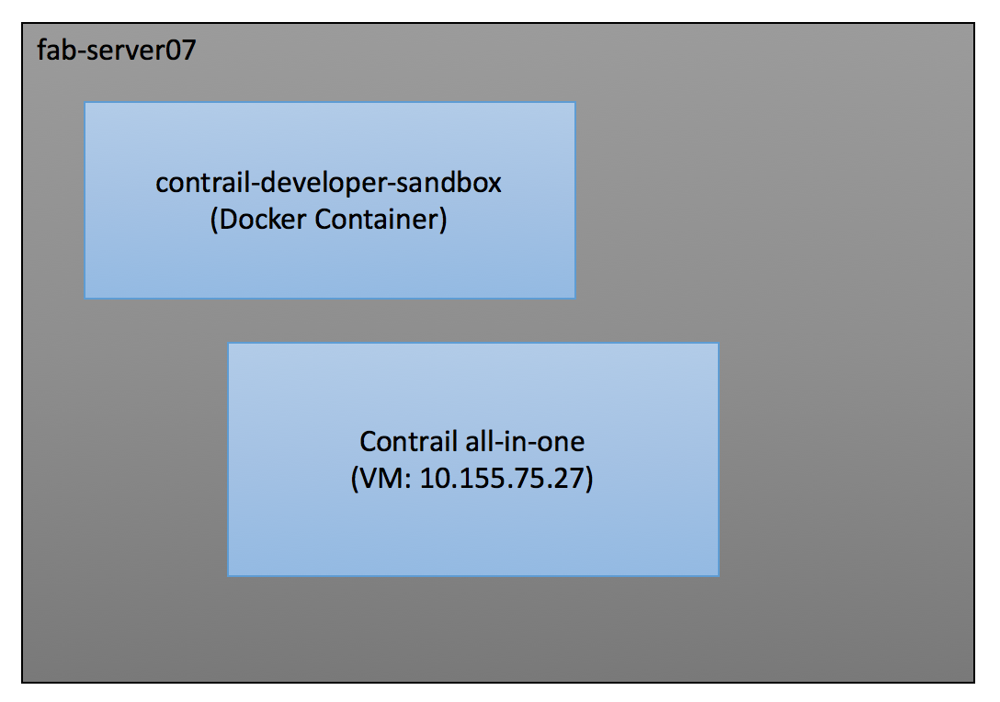
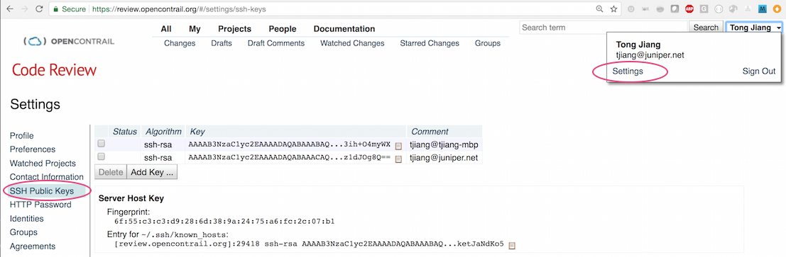

fab-server setup
================


## Contrail developer sandbox
Attach to the developer sandbox and build contrail:
```
$ docker ps 
$ docker attach contrail-developer-sandbox
$ cd contrail
$ scons --kernel-dir=$KERNELDIR
```
To start the sandbox VM if it is down. 
```
$ cd contrail-dev-env
$ sh startup.sh
```
Once you attach to the sandbox container, there is only one shell to work with. So it is recommended to use tmux so that you can have multiple shells. Here are the tmux cheatsheet:
```
ctrl-a w  # list all windows
ctrl-a c  # create a new window
ctrl-a d  # detach from tmux
ctrl-a n  # go to next window
ctrl-a p  # go to previous window
ctrl-a 1  # go to the first window
```

## Contrail VM
Here are the steps to create target VM loaded with Contrail nightly build:
1. Destroy the existing vagrant VM
```
$ cd /root/fab-server-setup
$ vagrant destroy
```
2. Go to https://hub.docker.com/r/opencontrailnightly/contrail-openstack-neutron-init/tags/ and copy the tag name for the nightly build.
3. Run `vmcreate.sh` script to spawn the VM loaded with the nightly build
```
$ cd /root/fab-server-setup
$ sh vmcreate.sh <tag name>
```

#### How do I access the VM?
To access the VM from the fab-server:
```
$ cd /root/fab-server-setup
$ vagrant ssh
```
The VM ip is based on the fab-server name. 
- `fab-server02`:  `10.155.75.22`
- `fab-server04`:  `10.155.75.24`
- `fab-server05`:  `10.155.75.25`
- `fab-server06`:  `10.155.75.26`
- `fab-server07`:  `10.155.75.27`
- `fab-server08`:  `10.155.75.28`
- `fab-server09`:  `10.155.75.29`

## Re-image fab-server
To re-image a fab-server, you need go to fab-server03 and run the following commnands:
```
$ cd /root/fab-server-setup/fab-server
$ ansible-playbook --extra-vars server=<fab server name> provision_fab_server.yml 
```
Here are the valid fab server names: 
- `fab-server02`
- `fab-server04`
- `fab-server05`
- `fab-server06`
- `fab-server07`
- `fab-server08`
- `fab-server09`

## Code commit
Here are the steps to commit code to contrail-controller:
#### Step 1: Create a bug in launch pad
Please add as much details as possible about the bug to fix or feature to add. Here is the link to Contrail launchpad:  https://bugs.launchpad.net/juniperopenstack
#### Step 2: Sync the latest code to the sandbox container
```
$ docker attach contrail-developer-sandbox
$ cd /root/contrail
$ repo sync
```
#### Step 3: Create a twig branch for the bug fix or feature
```
$ cd /root/contrail/controller
$ git checkout -b <bug-id> # replace <bug-id> with the bug id from Step 1.
```
Now you can make code changes in this twig branch
#### Step 4: Submit code to gerrit for reivew
1. **Make sure git-review is installed in the sandbox container.**
```
$ pip install git-review
```

2. **Generate ssh key via `ssh-keygen` on the sandbox container and Upload the generated public key to https://review.opencontrail.org.**


3. **Commit the change to local git via `git commit -a` with commit comments that follows the convention below:**
```
[DM] <short description of the commit that should not exceed 80 characters> 
<add multi-line detailed descriptions. You can list all the feature added by this commit or root cause of the bug this commit is trying to fix>

Partial-Bug: #<bug-id>
```
- `[DM]` specify the component name that is mandatory for the commit
- `#<bug-id>` should be the bug id from Step 1
- `Partial-Bug` is the directive to set the bug status. `Partial-Bug` means not to change the bug status. `Closes-Bug` means to close the bug after the commit is merged to the master.

4. **Submit code for review**
```
$ git review
```
To submit more changes to the existing review, you need to use `--amend` to amend existing commit
```
$ git commit -a --amend
$ git review
```
To check the submitted review, please go to https://review.opencontrail.org.
