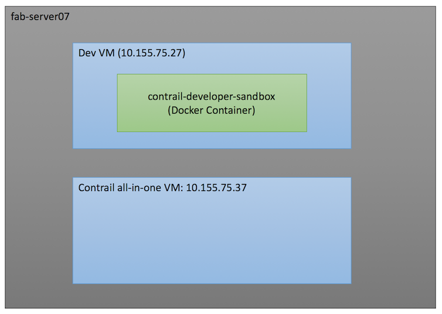

fab-server setup
================


## Dev VM
This is the VM that contains the Contrail developer sandbox Docker container. Here are the steps to get into the dev VM as root user: 
```
$ cd /root/fab-server-setup/dev_vm
$ vagrant ssh
$ su
password: vagrant
```
Once inside the dev VM as root, here are the steps to get into developer sandbox Docker container and run `scons` to build Contrail
```
$ docker exec -it contrail-developer-sandbox bash
$ cd /root/contrail
$ scons
```

To start the sandbox VM if it is down. 
```
$ docker restart contrail-developer-sandbox
```

## Contrail all_in_one VM
Here are the steps to create target VM loaded with Contrail nightly build:
1. Destroy the existing vagrant VM
```
$ cd /root/fab-server-setup/all_in_one
$ vagrant destroy
```
2. Go to https://hub.docker.com/r/opencontrailnightly/contrail-openstack-neutron-init/tags/ and copy the tag name for the nightly build. Or you can use tag name `latest` for the latest nightly build.
3. Run `create_contrail_vm.sh` script to spawn the VM loaded with the nightly build
```
$ cd /root/fab-server-setup/all_in_one
$ sh create_contrail_vm.sh <tag name>
```

#### How do I access the VM?
To access the VM from the fab-server:
```
$ cd /root/fab-server-setup/all_in_one
$ vagrant ssh
$ su
password: vagrant
```

The VM ip is based on the fab-server name. 
- `fab-server02`:  `10.155.75.32`
- `fab-server04`:  `10.155.75.34`
- `fab-server05`:  `10.155.75.35`
- `fab-server06`:  `10.155.75.36`
- `fab-server07`:  `10.155.75.37`
- `fab-server08`:  `10.155.75.38`
- `fab-server09`:  `10.155.75.39`

## Code commit
Here are the steps to commit code to contrail-controller:
#### Step 1: Create a bug in launch pad
Please add as much details as possible about the bug to fix or feature to add. Here is the link to Contrail launchpad:  https://bugs.launchpad.net/juniperopenstack
#### Step 2: Sync the latest code to the sandbox container
```
$ docker attach contrail-developer-sandbox
$ cd /root/contrail
$ repo sync
```
#### Step 3: Create a twig branch for the bug fix or feature
```
$ cd /root/contrail/controller
$ git checkout -b <bug-id> # replace <bug-id> with the bug id from Step 1.
```
Now you can make code changes in this twig branch
#### Step 4: Submit code to gerrit for reivew
1. **Make sure git-review is installed in the sandbox container.**
```
$ pip install git-review
```

2. **Generate ssh key via `ssh-keygen` on the sandbox container and Upload the generated public key to https://review.opencontrail.org.**


3. **Commit the change to local git via `git commit -a` with commit comments that follows the convention below:**
```
[DM] <short description of the commit that should not exceed 80 characters> 
<add multi-line detailed descriptions. You can list all the feature added by this commit or root cause of the bug this commit is trying to fix>

Partial-Bug: #<bug-id>
```
- `[DM]` specify the component name that is mandatory for the commit
- `#<bug-id>` should be the bug id from Step 1
- `Partial-Bug` is the directive to set the bug status. `Partial-Bug` means not to change the bug status. `Closes-Bug` means to close the bug after the commit is merged to the master.

4. **Submit code for review**
```
$ git review
```
To submit more changes to the existing review, you need to use `--amend` to amend existing commit
```
$ git commit -a --amend
$ git review
```
To check the submitted review, please go to https://review.opencontrail.org.

## Debug API server
Here is WIKI for debugging API server container: https://github.com/jnpr-tjiang/fab-server-setup/wiki/Debug-API-server

## Setup SSH Access
For easier accessibility, you should setup SSH access for the developer VM and all in one VM.
Refer to the instructions here [Setup-SSH](Setup-SSH.md)
